# Git 实用指南
<!-- TOC -->

- [Git 实用指南](#git-实用指南)
    - [版本控制系统（VCS）](#版本控制系统vcs)
        - [版本控制：最基本的功能](#版本控制最基本的功能)
        - [主动提交机制：VCS 与普通文本编辑器的区别](#主动提交机制vcs-与普通文本编辑器的区别)
        - [中央仓库：多人合作的同步需求](#中央仓库多人合作的同步需求)
        - [中央式版本控制系统](#中央式版本控制系统)
    - [分布式版本控制系统（DVCS）](#分布式版本控制系统dvcs)
    - [快速上手](#快速上手)
    - [本地初始化仓库并推送到 GitHub](#本地初始化仓库并推送到-github)
    - [关联 GitHub 与本机的 SSH Key](#关联-github-与本机的-ssh-key)
    - [git pull](#git-pull)
    - [HEAD / master / branch 理解](#head--master--branch-理解)
    - [branch xx / checkout branch xx / checkout -d xx / branch -d xx / branch -a](#branch-xx--checkout-branch-xx--checkout--d-xx--branch--d-xx--branch--a)
    - [push 的本质](#push-的本质)
    - [git merge <被合并分支>](#git-merge-被合并分支)
        - [冲突（conflict）](#冲突conflict)
        - [HEAD 领先于目标 commit](#head-领先于目标-commit)
        - [HEAD 落后于目标 commit](#head-落后于目标-commit)
    - [Feature Branching 工作流](#feature-branching-工作流)
        - [代码审阅（branch / commit / push / review / merge）](#代码审阅branch--commit--push--review--merge)
        - [pull request](#pull-request)
        - [一人多任务](#一人多任务)
    - [关于 add](#关于-add)
    - [看看我改了什么](#看看我改了什么)
    - [不喜欢 merge 的分叉？用 rebase 把](#不喜欢-merge-的分叉用-rebase-把)
        - [注意事项](#注意事项)
        - [应用场景](#应用场景)
    - [修正 commit](#修正-commit)
    - [修正指定 commit](#修正指定-commit)
    - [撤销 commit —— reset](#撤销-commit--reset)
    - [撤销指定 commit —— rebase -i](#撤销指定-commit--rebase--i)
    - [撤销已 push 的 commit —— revert](#撤销已-push-的-commit--revert)
    - [](#)

<!-- /TOC -->

## 版本控制系统（VCS）

**版本控制** / **主动提交** / **中央仓库** 构成了一个最核心的版本控制系统。

### 版本控制：最基本的功能

版本控制系统最基本的功能是版本控制。版本控制，简单的理解就是在文件中的修改历程中保存修改历史，我们可以方便的撤销之前对文件的修改。

在普通文本编辑器中，我们可以使用 Undo 操作回退到上一次的操作；在程序编码，我们可以通过 VCS 回退到指定的一次操作，而不仅仅是上一次操作。

### 主动提交机制：VCS 与普通文本编辑器的区别

使用普通文本编辑器的时候，一次保存就是一次改动，对版本的 `控制` 仅仅是回退到上一次操作。而正常情况下，我们的程序代码修改的生命周期十分长，一次代码的修改，在几天后、几个月后、甚至几年后都可能被翻出来。此时像普通编辑器的“自动保存提交”的功能在对历史代码审查、回退中会变得非常繁琐和无章可循。所以和普通文本编辑器的“撤销”功能不同，VCS 保存修改历史，使用 `主动提交改动` 的机制。

所谓 `主动提交改动` ，是指每次代码的修改和保存不会自动提交，需要手动提交（commit）到仓库，VCS 会把这次提交记录到版本历史中，当往后需要回退到这个版本，可以在 VCS 的历史提交纪录中找到这条记录。

### 中央仓库：多人合作的同步需求

中央仓库作为代码的存储中心，所有人的改动都上传到这里，所有人都可以看到并下载别人上传的改动。

版本控制 / 主动提交 / 中央仓库 这三个要素，共同构成了版本控制系统 VCS 的核心：开发团队中的每个人向中央仓库中主动提交自己的改动和同步别人的改动，并在需要的时候查看和操作历史的版本，这就是版本控制系统。

### 中央式版本控制系统

最基本的模型是：在一台服务器中初始化一个中央仓库，每个人从中央仓库下载初始版本开始并行开发，提交各自的代码到中央仓库并更新其他人的代码同步到自己的机器上。

团队中的每个人需要做的就是：1. 第一次加入团队，从中央仓库取代码到本地； 2. 写好的新功能提交到中央仓库； 3. 同事有新的代码提交，及时同步到本地。实际开发中当然还会经常需要处理代码冲突、查看代码历史、回退代码版本等。

## 分布式版本控制系统（DVCS）

分布式 VCS 和中央式 VCS 的区别在于：分布式 VCS 除了有中央仓库之外，还有本地仓库，团队中的每个人的机器上都有一个本地仓库，这个仓库中保存着版本的所有历史，每个人都可以在自己的机器的本地仓库中提交代码、查看历史而无需联网与中央仓库交互，取而代之的，只需要和本地仓库交互。

中央式 VCS 的中央仓库有两个主要功能：`保存版本历史` /  `同步代码` 。而在分布式的 VCS 中，保存版本历史转移到了每个人的本地仓库，中央仓库只剩下同步代码这一个主要任务。当然中央仓库也会保存版本历史，不过这个历史只是作为团队同步代码的中转站。

## 快速上手

1. 在 github 上新建一个仓库： `git-practical-guide`

2. 在指定路径克隆该远程仓库到本地： `git clone https://github.com/yuzh233/git-practical-guide.git`

3. 查看日志： `git log` ，若日志信息太长，按 q 退出。

   ```bash
   $ git log
   commit 0a00230727018a14d481fe482e8e85f7b312e39c (HEAD -> master, origin/master, origin/HEAD)
   Author: yu_zh <yuzh233@163.com>
   Date:   Wed Oct 3 00:23:27 2018 +0800

       Initial commit
       
   -- github 默认创建了一次提交

   ```

4. 新建一个文件，自己创建一个提交：但先查看一下状态 `git status`

   ```bash
   $ git status
   On branch master
   Your branch is up to date with 'origin/master'.

   Untracked files:
     (use "git add <file>..." to include in what will be committed)

           README.md

   nothing added to commit but untracked files present (use "git add" to track)

   -- 当前分支是主分支，并且当前分支是最新的（相对于中央仓库）
   -- 有一个未追踪的文件 “README.md” ,可以使用 git add 追踪文件（提交）
   ```

5. 追踪文件： `git add README.md`，再次 `git status`。 添加全部文件到暂存区：`git add . / git add -A`

   ```bash
   $ git status
   On branch master
   Your branch is up to date with 'origin/master'.

   Changes to be committed:
     (use "git reset HEAD <file>..." to unstage)

           new file:   README.md

   -- 当前分支是最新的，已暂存一个新文件：README.md，该文件由“未追踪”变成了“已暂存”，表明这个文件被改动的部分已进入“暂存区”
   ```

6. 提交文件：`git commit` 。进入 vim 填写提交的描述信息保存退出即可。也可以 `git commit -m "描述信息"`

   ```bash
   $ git commit

   *** Please tell me who you are.

   Run

     git config --global user.email "you@example.com"
     git config --global user.name "Your Name"

   to set your account's default identity.
   Omit --global to set the identity only in this repository.

   fatal: unable to auto-detect email address (got 'Administrator@YU-ZH.(none)')

   -- 首次提交需要指明身份（额外一点：github的贡献值是以邮箱地址作为提交的记录标识，如果 setting 里面没有添加该邮箱，那么贡献值会不存在。）

   Administrator@YU-ZH MINGW64 /d/IdeaProjects/git-practical-guide (master)
   $ git config --global user.email "yuzh233@gmail.com"

   Administrator@YU-ZH MINGW64 /d/IdeaProjects/git-practical-guide (master)
   $ git config --global user.name "yu.zh"

   Administrator@YU-ZH MINGW64 /d/IdeaProjects/git-practical-guide (master)
   $ git commit
   [master 967f40b] add README.md
    1 file changed, 76 insertions(+)
    create mode 100644 README.md

   ```

7. 再查看一次日志吧：`git log`

   ```bash
   $ git log
   commit 967f40b3fd29f102fc84f62ac9d20243db2a99b4 (HEAD -> master)
   Author: yu.zh <yuzh233@gmail.com>
   Date:   Wed Oct 3 21:50:03 2018 +0800

       add README.md

   commit 0a00230727018a14d481fe482e8e85f7b312e39c (origin/master, origin/HEAD)
   Author: yu_zh <yuzh233@163.com>
   Date:   Wed Oct 3 00:23:27 2018 +0800

       Initial commit

   -- 可以看到，一共有两次提交记录，最近的一次提交在最前面。
   -- origin/master, origin/HEAD 是对远端仓库的 master 和 HEAD 的本地镜像。
   ```

8. 当我们的文件有修改时，需要更新到本地仓库。先看一下状态是个好习惯： `git status`

   ```bash
   $ git status
   On branch master
   Your branch is ahead of 'origin/master' by 1 commit.
     (use "git push" to publish your local commits)

   Changes not staged for commit:
     (use "git add <file>..." to update what will be committed)
     (use "git checkout -- <file>..." to discard changes in working directory)

           modified:   README.md

   no changes added to commit (use "git add" and/or "git commit -a")

   -- 当前位于主分支，当前分支“领先于”远程仓库主分支一个提交
   -- 未提交的一个更改 README.md ，git 认识这个文件，但它不是一个新文件了，我们把它同步为最新的。
   ```

9. 依然是： `git add README.md`

10. 查看状态： `git status`

    ```bash
    $ git status
    On branch master
    Your branch is ahead of 'origin/master' by 1 commit.
      (use "git push" to publish your local commits)

    Changes to be committed:
      (use "git reset HEAD <file>..." to unstage)

            modified:   README.md

    -- 一个文件被改动了
    ```

11. 提交： `git commit`

12. 此时查看下日志：`git log`

    ```bash
    $ git log
    commit 7ba78ab8cef21de0174884ef13fb6210f9552fe3 (HEAD -> master)
    Author: yu.zh <yuzh233@gmail.com>
    Date:   Wed Oct 3 22:10:13 2018 +0800

        update README.md

    commit 967f40b3fd29f102fc84f62ac9d20243db2a99b4
    Author: yu.zh <yuzh233@gmail.com>
    Date:   Wed Oct 3 21:50:03 2018 +0800

        add README.md

    commit 0a00230727018a14d481fe482e8e85f7b312e39c (origin/master, origin/HEAD)
    Author: yu_zh <yuzh233@163.com>
    Date:   Wed Oct 3 00:23:27 2018 +0800

        Initial commit

    ```

13. 此时本地仓库已经领先于中央仓库，把本地仓库推送到中央仓库：`git push` / `git push origin master`

**小结**

- git clone url

- git log

- git status

- git add 文件 / git add . / git add -A

- git commit / git commit -m "info"

- git push / git push origin master

## 本地初始化仓库并推送到 GitHub
1. 某个项目文件夹执行 `git init`

2. `git log / git add / git commit / git status` 啥的都来一遍

3. 在 github 创建与本地同名的仓库，如果本地有 README.md 远程就不要勾选创建这个文件，否则会冲突。

4. 关联远程库: `git remote add origin git@github.com:yuzh233/demo.git ` or `git remote add origin https://github.com/yuzh233/demo.git`

5. 推送到远程库：`git push -u origin master` ，需要先关联 GitHub 与本机的 SSH Key.

## 关联 GitHub 与本机的 SSH Key 
1. 先确保已经在 git 中保存了全局用户名和邮箱

    git config --global user.name "yourname"

    git config --global user.email“your@email.com"

2. 删除 C:\Users\Administrator\.ssh\known_hosts 文件

3. bash 输入 `ssh-keygen -t rsa -C "yuzh233@gmail.com"`，出现提示信息，一路回车，然后系统会自动在.ssh文件夹下生成两个文件，id_rsa 和 id_rsa.pub。

4. 打开 id_rsa.pub 将全部内容复制到 Github->setting->SSH and GPG keys->New SSH key->key

5. `ssh -T git@github.com`

## git pull

pull 指令用于从中央仓库更新代码到本地仓库。当多人协作开发时，同事 A 先于同事 B push 自己的本地仓库代码到中央仓库后，同事 B 再 push 自己的本地仓库时会报错，原因是远程仓库含有本地没有的 commit 而导致 push 失败。此时同事 B 需要使用 `git pull` 将同事 A push 到远程仓库的内容更新下来，这样同事 B 的本地仓库就含有远程仓库的commit了，然后同事 B 才能执行自己的 push。

一种场景：同事A　commit了一条记录并 push 到远程仓库。同事B 也在自己的本地仓库中 commit 了一条记录后试图 push。此时 git 会发现远程仓库含有本地未有的提交 push 失败。于是同事B 执行 `git pull` ，**此时的 pull 并不会和往常一样结束，而是会进入一个 vim 的信息提示界面，需要输入提交信息（git默认填写了信息），原因是git不仅发现远程仓库含有本地仓库没有的提交，本地仓库也含有远程仓库没有的提交，git会将远程仓库的 commit 和本地仓库的 commit 合并（git mage）产生一条新的提交并添加默认描述信息。** 退出保存信息提示界面之后，pull就完成了，然后执行 push，此时本地仓库含有远程仓库所有的提交不会失败。

## HEAD / master / branch 理解

指向 commit 的快捷方式：**引用**

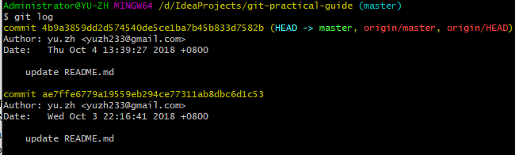

括号里的 `HEAD -> master, origin/master, origin/HEAD` ，都是指向这个 commit 的引用。commit 后面一大串的字符是当前提交的唯一标识符（SHA-1 校验和），提供引用机制是为了简化标识符，方便记忆。

**HEAD** 指向当前最新的 commit ，当前 commit 在哪里，HEAD 就在哪里，这是一个永远指向当前 commit 的引用。

HEAD 除了可以指向 commit，还可以指向一个 **branch**，当它指向某个 branch 的时候，会通过这个 branch 来间接地指向某个 commit；另外，当 HEAD 在提交时自动向前移动的时候，它会像一个拖钩一样带着它所指向的 branch 一起移动。

我们创建一个 commit 之后查看 log：

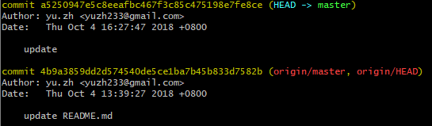

最新的 commit 被创建后，HEAD 和 master 这两个引用都指向了它，而在上面第一张图中的后两个引用 origin/master 和 origin/HEAD 则依然停留在原先的位置。

**branch** 可以理解为从初始 commit 到 branch 所指向的 commit 之间的所有 commit 集合的一个串。

- 所有的 branch 之间都是平等的

- branch 包含了从初始 commit 到它的所有路径，而不是一条路径。并且，这些路径之间也是彼此平等的。

**master** 是一个特殊的 branch ,是git默认的分支（主分支）。新创建一个 repository 的第一个 commit 时，会把 master 指向它，并把 HEAD 指向 master。

- 新建的仓库中的第一个 commit 会被 master 自动指向

- 在 git clone 时，会自动 checkout 出 master

## branch xx / checkout branch xx / checkout -d xx / branch -d xx / branch -a

创建一个分支：`git branch feature1`

切换到这个分支：`git checkout feature1`，此时 HEAD 指向了 feature1 这和分支了。

    创建一个分支并切换过去：git checkout -b feature1

我们在 feature1 分支中创建一个提交：添加 feature1.txt。此时 HEAD
指向了 feature1，feature1 指向当前提交。

又切换回 master 分支：`git checkout master`，在 master 创建一个提交：添加 master.txt，此时出现了分叉（两个分支有不同的提交）。

删除刚刚创建的分支：`git branch -d feature1`

- HEAD 指向的 branch 不能删除。如果要删除 HEAD 指向的 branch，需要先用 checkout 把 HEAD 指向其他地方。

- branch 只是一个引用，删除引用并不会删除该引用路径上的所有 commit 集合（不过一个 commit 不在任何一个 branch 路径上，就是个野生 commit 了，会被 git 垃圾回收掉）

- 没有被合并到 master 过的 branch 在删除时会失败。强制删除将 `-d` 改为 `-D`

删除远程的分支：`git push origin -d feature1`

查看所有分支：`git branch -a`

## push 的本质
push 是把当前的分支上传到远程仓库，并把这个 branch 的路径上的所有 commits 也一并上传。

push 的时候，如果当前分支是一个本地创建的分支，需要指定远程仓库名和分支名，用 `git push origin 分支名` 的格式，而不能只用 git push；或者可以通过 `git config` 修改 push.default 来改变 push 时的行为逻辑。

push 之后上传当前分支，并不会上传 HEAD；远程仓库的 HEAD 是永远指向默认分支（即 master）的。

## git merge <被合并分支>
`merge(合并)` 从目标 commit（被合并分支的最新commit） 和当前 commit （即 HEAD 所指向的最新 commit）分叉的位置起，把目标 commit 的路径上的所有 commit 的内容一并应用到当前 commit，然后自动生成一个新的 commit。

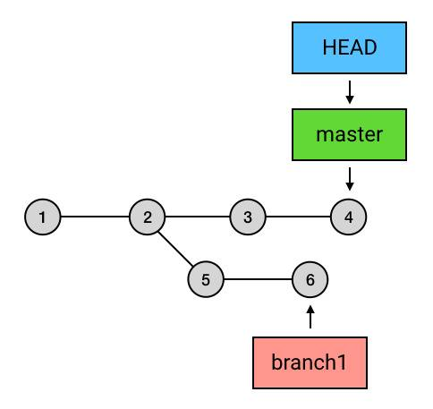

HEAD 指向 master，说明当前在主分支，执行 `git merge branch1`之后 git 会 在 commit 2 （交叉位置），将commit 5 和commit 6 合并到 commit 4，然后生成一个新的提交。

    首先创建一个分支 branch1，开始并行开发：
        git branch branch1
    -------------------------------------
    在 master 分支创建两个文件：
        touch a.txt
        touch b.txt
        
    添加并提交这两个文件：
        git add a.txt b.txt
        git commit -m "add a.txt b.txt"
    
    此时 master 分支有这两个文件
    -------------------------------------
    切换到 branch1 分支：
        git chekout branch1
    
    创建一个文件 c.txt 添加并提交：
        touch c.txt
        git add c.txt
        git commit -m "add c.txt"

    此时 branch1 分支含有 c.txt 这个文件
    --------------------------------------
    master 有自己的新提交：“a.txt / b.txt”，branch1有自己的新提交：“c.txt”，此时想将 branch1 的提交合并到 master 主分支上：
    
        git checkout master 先切换到主分支
        git merge branch1

    于是 master 就含有 a.txt / b.txt / c.txt 这三个文件了。

### 冲突（conflict）
> merge 在做合并的时候，是有一定的自动合并能力的：如果一个分支改了 A 文件，另一个分支改了 B 文件，那么合并后就是既改 A 也改 B，这个动作会自动完成；如果两个分支都改了同一个文件，但一个改的是第 1 行，另一个改的是第 2 行，那么合并后就是第 1 行和第 2 行都改，也是自动完成。<br>
但如果两个分支修改了同一部分内容，merge 的自动算法就搞不定了。这种情况 Git 称之为：冲突（Conflict）。

例如：git仓库中有一个文件 `shopping-list.txt`，内容如下：

    移动硬盘
    女装

我们用两个分支分别修改文件的同一个地方，先创建一个分支 feature1：

```bash
git branch feature1
```

在 master 中修改内容并提交：

```bash
    移动硬盘
    女装（已买）

git add shopping-list.txt
git commit -m "购买女装"
```

切换到 feature1 修改并提交：

```bash
git checkout feature1

    移动硬盘
    女装（没买）

git add shopping-list.txt
git commit -m "没买女装"
```

此时切换回 master ，执行 `git merge feature1`，git 傻了

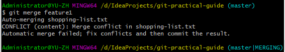

在 shopping-list.txt 中出现了 "merge conflict"，自动合并失败，要求 "fix conflicts and then commit the result"（把冲突解决掉后提交）

**第一步：解决冲突**，打开冲突的文件：

    移动硬盘
    <<<<<<< HEAD
    女装（已买）
    =======
    女装（没买）
    >>>>>>> feature1

发现内容有些变化，Git 虽然没有帮你完成自动 merge，但它对文件还是做了一些工作：它把两个分支冲突的内容放在了一起，并用符号标记出了它们的边界以及它们的出处。

我们要保留主分支的更改，即：“购买女装”，只要删除掉 feature1 的修改，再把 Git 添加的那三行 `<<< === >>>` 辅助文字也删掉，保存文件退出，冲突就解决了。

**第二步：手动提交**，提交解决冲突之后的文件：

```bash
git add shopping-list.txt # 这里 commit 前也需要先 add 一下
git commit
```

如果要放弃这次 merge ，可以执行：

```bash
git merge --abort
```

### HEAD 领先于目标 commit
如果 merge 时的目标 commit 和 HEAD 处的 commit 并不存在分叉，而是 HEAD 领先于目标 commit。

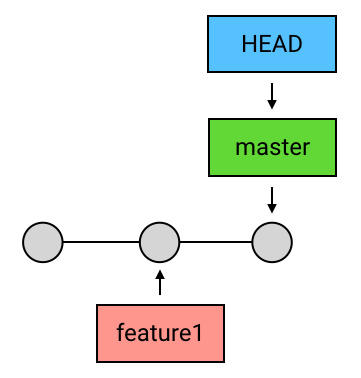

那么 merge 就没必要再创建一个新的 commit 来进行合并操作，因为并没有什么需要合并的。在这种情况下， Git 什么也不会做，merge 是一个空操作。

### HEAD 落后于目标 commit
如果 HEAD 和目标 commit 不存在分叉，但 HEAD 落后于目标 commit。那么 Git 会直接把 HEAD（以及它所指向的 branch，如果有的话）移动到目标 commit。这也叫做：“fast-forward”。

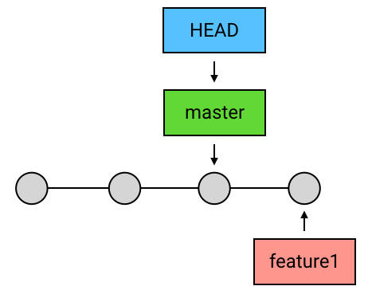

fast-forward 这种场景在 pull 中经常遇到：本地的 master 没有新提交，而远端仓库中有同事提交了新内容到 master，此时的 HEAD 落后于目标 commit（远程的 HEAD），而造成 "fast-forward"。

## Feature Branching 工作流
> 之前的工作模型是：所有人都在 master 分支上工作，commit 了代码通过 push 推送到远程仓库，获取别人的 commit 通过 pull。这种模型的局限性在于：每一个人的代码在被大家看到的时候，是它正式进入生产环境的时候。**所有人的代码都直接 push 到远程的 master，这就导致了每个人的代码在正式启用（投入生产环境）前无法被别人看到。** 这样就让代码在正式启用前的讨论和审阅极不方便。

feature branching 工作流解决了这种问题，该工作流的核心特点如下：

- 任何一个新功能（feature）和 bug 的修复都用一个新的 branch 来写；

- branch 写完之后，合并到 master，再删除这个 branch。

这种工作流为团队协作间的 **代码审阅 / 一人多任务** 提供解决方案。

### 代码审阅（branch / commit / push / review / merge）
假如要开发一个新的功能，我们创建一个分支 books ，开始开发：

    git checkout -b books # 创建分支并切换过去

十几个 commit 过后，功能开发完毕，告诉同事功能开发完毕，有时间帮我 review 一下呗，分支名是 books，然后把这个分支 push 上去：
 
    # 确保当前在 books 分支，将当前分支 push 到远程仓库的 books 分支。
    git push origin books
    
[ 模拟同事：review 刚刚上传的 books 分支：]

    # 克隆同事的仓库到桌面（如果同事有这个仓库就是 git pull ）
    git clone https://github.com/yuzh233/git-practical-guide.git
    cd git-practical-guide
    git checkout books # 切换到同事刚刚开发新功能的分支：books
    开始 review ...

[ review 完毕，同事：我觉得很 OK 啊~ 可以合并了！]

于是我一顿操作：

    git checkout master
    git pull # 保持更新，是个好习惯
    git merge books
    -- 此时 books 分支的内容合并到了 master 工作目录 --

紧接着，把合并后的 master push 上去，并删除本地和远程的 books 分支：

    git push
    git branch -d books # 删除本地 books 分支
    git push origin -d books # 删除远程 books 分支

一切都是这么的完美，然而此时一个同事发现不对，说：“嘿！你的代码缩进怎么是 tab ，快改成空格，不然砍死你哦~”，我一看情况不对，立马重复上面的操作：`新建分支、改代码、推送上去、同事审阅、合并、再推送、删除分支`，ok，空格党觉得很ok，乎~ perfect。[ 然而，发现事情没有这么简单... ]

```git
git branch books
git checkout books
--- tab 改为 空格 git add / git commit ---
git push origin books
---  review... ok ---
git checkout master
git merge books # 这里会出现 Fast-forward，原因是当前commit（HEAD）落后于目标commit（books 的 commit 比 master 的 HEAD 领先）
git push
git branch -d books
git push origin -d books
```
 
### pull request
> 在上一主题，同事取到我的新功能审阅代码，都是在自己本地中打开，觉得有问题一般都是通过短信电话，发邮件等。这样的审阅是很不方便的，而 pull request 就是对前面代码审阅过程的简化。

pull request 不是 git 的内容，而是 git 服务提供商（如 GitHub）提供的一种便捷功能，可以让团队方便的讨论一个 `branch`，并在讨论结束后一件合并这个 `branch` 到 `master`。

如：现在创建一个分支修改购物清单：“购买SSD”，并推送到远程仓库，github 会自动提示是否 pull request:

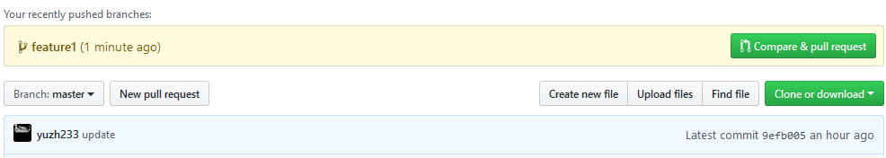

创建一个 pull request：

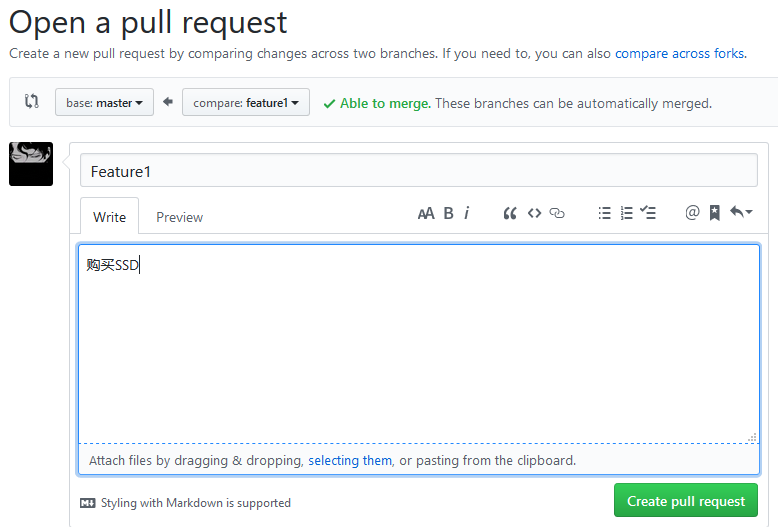

创建之后，其他同事就可以在 github 上看到我们的拉请求。他们可以在这个页面查看我们的所有 commit 并提建议，我们就可以根据同事们的建议提交新的 commit 并 push 到这个分支，这个页面会随着 push 展示最新的 commit。

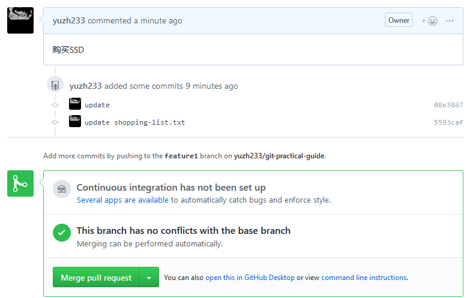

我们在 feature1 分支又决定不买SSD了，于是更新后重新 push，此时该界面也同步更新了一条 commit：

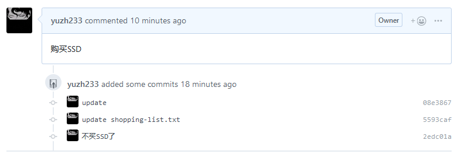

就这样，根据同事的意见不断的 push 新 commit 之后，最终一致决定没问题可以合并到 master 了，点击 `Merge pull request` ，GitHub 会自动在中央仓库中将 `feature1` 合并到 `master`。

### 一人多任务
利用 feature branching 工作流，一个多任务并行开发变得简单多了。当一个新任务下发时，我们仅需要将当前任务的分支简单收尾一下，回到主分支再开辟一个新任务的分支就可以开发新的任务了。

## 关于 add
add 指令除了 `git add 文件名` 这种用法外，还可以使用 `add .` 来直接把工作目录下的所有改动全部放进暂存区

add 添加的是文件改动，而不是文件名。也就是说,对文件修改之后通过 add 放入暂存区，**再修改一次该文件，然后执行 commit，第二次的修改并没有提交**，原因是第二次改动了内容没有重新 add。

- add 也支持匹配表达式，如 `add *.java`

- add 文件进暂存区，又不想 add 了，使用：`git reset HEAD filename`

## 看看我改了什么
- 查看历史记录 `git log`

- 查看详细历史记录 `git log -p`

- 查看概要历史记录 `git log --stat`

- 查看当前（HEAD指向的） commit 的信息 `git show `

- 查看指定 commit 的信息：`git show <commit的引用>`

- 查看指定 commit 中的某个文件的改动：`git show 2edc shopping-list.txt
`

- 查看工作区和暂存区的区别：`git diff`

- 查看暂存区和上一条提交的区别：`git diff --staged`

- 查看工作目录和上一条 commit 的区别：`git diff HEAD`

## 不喜欢 merge 的分叉？用 rebase 把
> rebase —— 给当前 commit 序列重新设置基础点（也就是父 commit）。就是说，把指定的 commit 以及所在的 commit 串，以指定的目标 commit 为基础（头），重新作为一次提交。

例如：下面是一个 `merge` 操作: `git merge branch1`

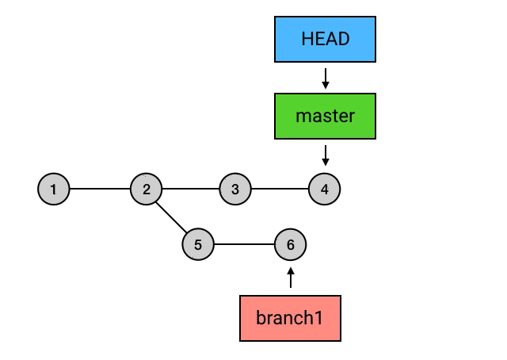

如果把 `merge` 换成 `rebase`：

    git checkout branch1 
    git rebase master

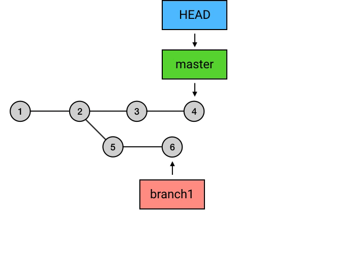

可以看到，通过 rebase，将 commit 5 和 commit 6 这个 commit 串，从原有的父节点 commit 2 移到现在的父节点 commit 4。通过这样，让原本分叉的提交历史重新回到了一条线。这种 [ 重新设置基础点 ] 的操作，就是 `rebase` 的含义。

在 branch1 分支 `rebase` master 之后，branch1 跑到 master 前面变成了同一条线，但是实际上还是两个**彼此独立**的分支，只不过 branch1 现在是以 master 的 HEAD（即：commit 4） 作为 `基础点（commit 串的头）`。**master 的 HEAD 是 `commit 4`，branch1 的 HEAD 是 `commit 8`，并且 branch1 的 commits 领先于 master 的 commits。**

我们希望用 rebase 之后能实现和 merge 一样的合并两条分支的效果，那么怎么做呢？其实还是需要用到 `merge` 操作，**当前分支（master）与目标分支（branch1）没有分叉，并且当前 HEAD 落后于目标分支的 commit，使用 `merge`，将 HEAD 移到目标的 commit**，这就是前面学到过的 [Fast-Forward](#head-落后于目标-commit)。

    git checkout master # 还需先切换回 master
    git merge branch1

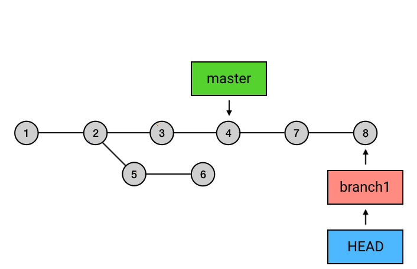

[ 蒙圈了怎么办，演示一把： ]

    -----------< 新建一个分支 >-----------
    git branch branch1 
    -----------< 在 master 创建一个提交 >-----------
    touch a.txt 
    git add a.txt
    git commit -m "add a.txt"
    -----------< 在 branch1 创建一个提交 >-----------
    git checkout branch1
    touch b.txt / touch c.txt
    git add b.txt c.txt
    git commit -m "add b.txt c.txt"
    -----------< 想把 branch1 合并到 master 但是不想有分叉 >-----------
    # 注意：必须先切换到被合并的分支！
    git checkout branch1
    git rebase master
    
[ 此时，branch1 和 master 属于同一条线，但是 branch1 领先于 master：]

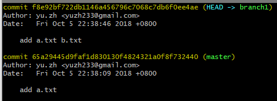

[ branch1 的新提交是 a.txt / b.txt ，master 的新提交是 a.txt，此时合并到 master：`git checkout master / git merge branch1`]

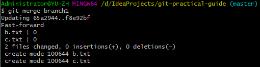

[ 可以看出是一个快速前移操作，此时的日志：master 已经移到了最新的 commit]

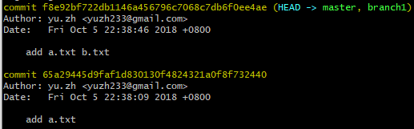

### 注意事项

- merge 操作是在合并分支上进行的；

- rebase 操作是在 **被合并** 分支上进行的，这点很重要。

- rebase 是带着当前 commit 移到别的 commit 上「去」，而 merge 则是把别的 commit 合并过「来」

“ 为什么要在被合并分支 `branch1` 上执行 rebase，在合并分支 `master`上执行 merge，而不是直接在 `master`上执行 rebase 呢？”

—— 简单的理解就是：这两种 rebase 本身就是两种不同的情况，如果在 master 上 rebase：`git checkout master / git rebase branch1` ，**master 就会带着它的 commit 串内容作为新的 commit 跑到 branch1 的 HEAD 前面去啦！** master 跑到了 branch1 这条线上，master 的 commit 的内容还是以前的内容，但是却不是同一个 commit 了，只不过是内容相同的另外一个 commit罢了。而如果远程仓库有之前 master 的 commit，但是在本地仓库中找不到远程库对应的这个 commit，会因为远程库含有本地没有的 commit 导致 push 失败！

### 应用场景
> 你自己开发分支一直在做，然后某一天，你想把主线的修改合到你的分支上，做一次集成，这种情况就用 rebase 比较好。把你的提交都放在主线修改的头上。

参考：[git rebase 还是 merge的使用场景最通俗的解释](https://www.jianshu.com/p/4079284dd970)

## 修正 commit
用 `commit --amend` 修复当前提交的错误。在 commit 一条提交之后发现写错了，我要买：“机械键盘”，可以使用 `commit --amend` 指令来修正本次提交的错误。git 不会在当前 commit 上增加 commit ，而是把当前 commit 里的内容和暂存区的内容合并起来形成一个新的 commit，**用新的 commit 把当前的 commit 替换掉**。

[ 我们在购物清单中添加一个：“薄膜键盘”，提交之后发现写错了... 于是将内容重新修改，并重新 add 到暂存区，使用 commit --amend 指令覆盖当前提交：]

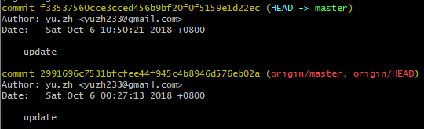

修正之后可以发现只有一条 commit 记录。

## 修正指定 commit
> 交互式 rebase：`git rebase -i <指定 commit 链的头>` <br>
所谓交互式 rebase，就是在 rebase 的操作执行之前，指定要 rebase 的 commit 链中的每一个 commit 是否需要进一步修改。

    -------< 第一次提交 >-------
    我们在文件 rebase-i.txt 中添加一行
    aaaaa
    后执行提交：git add rebase-i.txt / git commit -m "aaaaa"
    -------< 第二次提交 >-------
    在文件 rebase-i.txt 中又添加一行
    bbbbb
    后执行提交：git add rebase-i.txt / git commit -m "bbbbb"
    
查看日志：

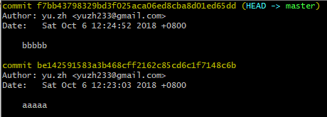

但是发现 "aaaaa" 这个提交的内容写错了，想要修改这次提交。由于不是最新的提交，不能使用 commit --amend 来修正。

> 可以使用 rabse，不过此时的 rebase 是在同一条基线上，也叫 [原地 rebase]，通过原地变基，指定一个 commit ，将其所在的 commits 串从父基础点断开。然后对该 commits 串中的每一个 commit 修改后重新挂在原来的父基础点。

使用 `git rebase -i HEAD^^` or `git rebase -i HEAD~2` 来指定从哪个 commit 开始变基。（rebase 之前需要将工作空间新的修改放入暂存区，所以现在有了三条提交。）

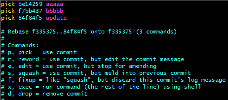

我们要修正指定的 commit，将需要被修正的 commit 对应的操作由 `pick` 改为 `edit`（应用当前的提交，但是停下来修正）：


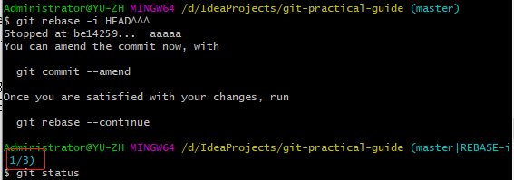

根据提示信息：rebase 已经停到了 "aaaaa" 这个提交，现在可以修正这个提交：

```shell
修改 aaaaa 为 aaaaa_amend
git commit --amend # 应用这个修复
```

修复了第一个之后，执行：`git rebase --continue` 继续执行第二个：第二个也是修复，对文件修改 amend 之后继续 continue ，第三个 commit 是默认操作是 pick（应用当前的提交），不执行任何操作，至此rebase完毕。

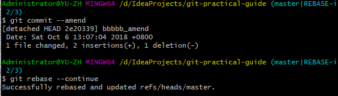

## 撤销 commit —— reset
git add 后撤销：

- 撤销所有add文件 `git reset HEAD .`

- 撤销单个add文件 `git reset HEAD -filename`

git commit 后撤销：

- 只回退 commit 的信息，保留修改代码：`git reset --soft head`

- 回退到上次 commit 版本，不保留修改代码：`git reset --hard head^`

    HEAD ：当前版本

    HEAD^ ：上一个版本

    --hard 参数会抛弃当前工作区的修改
    
    --soft 参数的话会回退到之前的版本，但是保留当前工作区的修改，可以重新提交

## 撤销指定 commit —— rebase -i

现有三条提交，要撤销第二条提交：

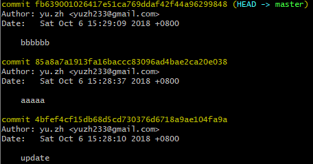

`git rebase -i HEAD~3` 操作当前 commit 所在 commits 链中三条 commit：

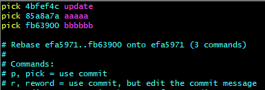


撤销某个 commit ，将这一行删除即可。此时第二条 commit 被删掉了：

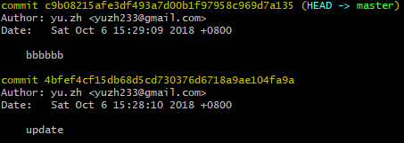

## 撤销已 push 的 commit —— revert
`git revert` 撤销某次操作，此次操作之前和之后的 commit 和 history 都会保留，并且把这次撤销作为一次最新的提交。

比如我们我们对文件`rebase-i.txt`添加两次修改并提交两次后 push 到远程库：

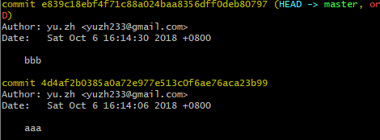

我们要撤销前一次提交:"bbb"，也就是删除文件中的“bbb”这一行：`git revert HEAD`

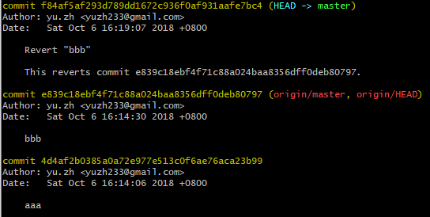

可以看到执行完之后增加了一条新的 commit，它的内容和最新的 commit 是相反的，从而和最新的 commit 相互抵消，达到撤销的效果。

> 把新的 commit 再 push 上去，这个 commit 的内容就被撤销了。它和前面所介绍的撤销方式相比，最主要的区别是，这次改动只是被「反转」了，并没有在历史中消失掉，你的历史中会存在两条 commit ：一个原始 commit ，一个对它的反转 commit。

## 